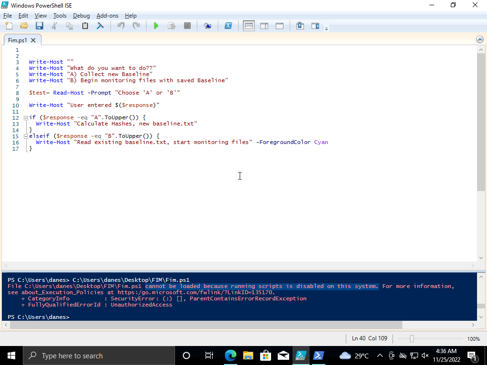
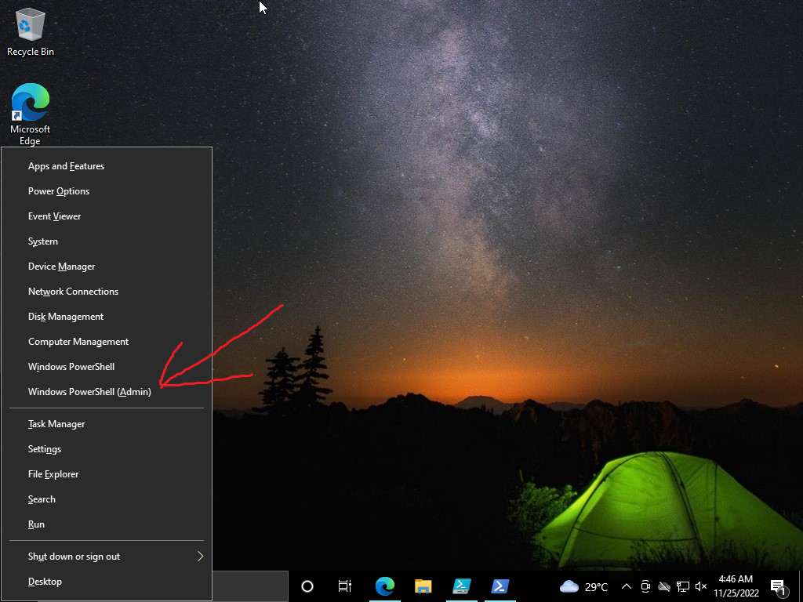
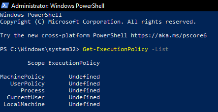
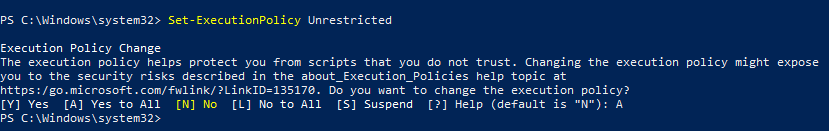
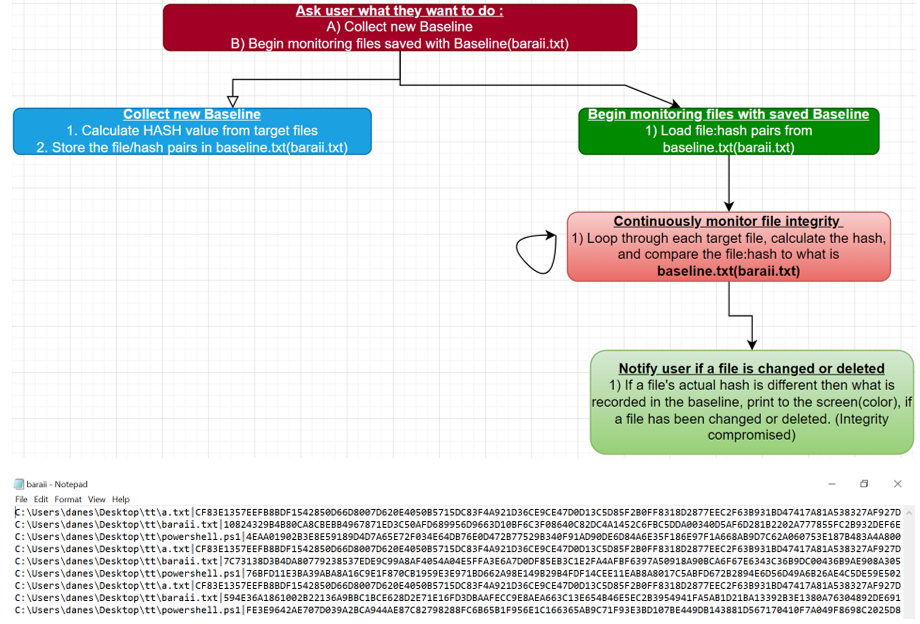
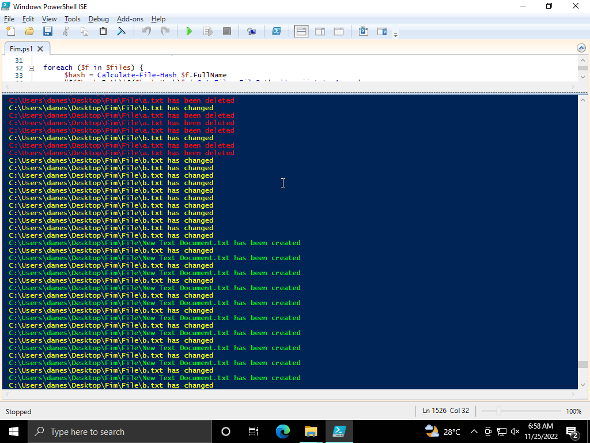
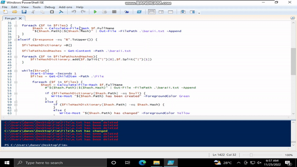

# FIM-File_Integrity_Monitor
Basic Level Powershell Project to Monitor Files Integrity

So technically this software is meant to monitor the integrity of a given file. It's meant to monitor any changes of tempering done by a malicious actor or just for general privacy given we have some *wink wink* file (;

Okay on a serious note, this is part of the CIA(Confidentiality, Integrity, Availability) triad of cybersecurity. A real life example of the importance of this project goes something like this. Lets say an individual with a high post in a given organization uses his work laptop in a coffe shop and goes for a washroom break without locking his device, a random stranger (doesnt even need to be a hacker) can just copy/delete important details from the device and vanish without a trace. The affected individual will never know what hit him until its often times too late. So its safe to say a software like this carries quite a value. This project leans more towards Integrity but it can really affect all parts of the triad. 

Example :

Confidentiality : Given files a tempered with, it can lead to confidential information leaking.

Integrity : If information can be tempered with or change in a whim, the value or better terms, it's INTEGRITY becomes heavily under fire. 

Availability : When a file can be easily changed/edited/deleted getting it when we want in the preferred format or even having it there on the device will become a massive issue.

So yeah the importance of this project speaks for itself.

<ins>**Requirements**</ins>

You dont really need anything for this project. Just an Windows OS or VM will be just fine. You just need to run the [code](https://github.com/Maverick1102/FIM-Integrity/blob/main/powershell.ps1) and maybe make a few text files to see the execution of the system.

<ins>***WHILE DOING SO***</ins>, if you try running the code and get this error :

Kindly, follow these steps :
1) Press **WINDOWS + X** key or right-click on the Start button and click **Run as Administrator** :

2) Type in **Get-ExecutionPolicy -List**

3) Then type in **Set-ExecutionPolicy Unrestricted**

4) Then hit **A** key and we're all good to go.

(If the error still  persists, **Set-ExecutionPolicy Unrestricted -Force**)

<ins>**Walkthrough**</ins>

So we are gonna build the system based on this flowchart. We will be constantly checking the baseline(baraii.txt) to see what deviations have occured to the folder of choice. 

You can use the [code](https://github.com/Maverick1102/FIM-Integrity/blob/main/powershell.ps1) from the repo, just make sure to change what's needed and test it out.

You should recieve outputs like this given all is good :

<ins>**Demonstration**</ins>

This is the demo of how the system is meant to be used : 

So thats about it, adios ((:
